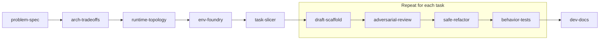

<div align="center">

# craftsman-suite

**Ten agent skills that take a project from idea to documented code, one human-reviewed step at a time.**

[](LICENSE)
[](https://github.com/Linchi1997yeh/craftsman-suite/releases)
[](https://github.com/Linchi1997yeh/craftsman-suite/stargazers)
[](https://agentskills.io)

[Install](#install) · [Quick start](#quick-start) · [How it works](#how-it-works) · [Skills](#skills) · [Roadmap](#roadmap)

</div>

---

AI coding workflows usually fail by jumping from an informal prompt straight to a large block of code. The result is scope creep, unhandled edge cases, hallucinated dependencies and architectural drift.

**craftsman-suite** splits the work into 10 focused skills. Each one writes its result to a git-tracked file, then **stops and waits for you**. Built on the open [`SKILL.md`](https://agentskills.io) standard, so it works in Claude Code, Codex, Cursor, Gemini CLI, OpenCode and more.

## Install

**Claude Code**

```bash
/plugin marketplace add Linchi1997yeh/craftsman-suite
/plugin install craftsman-suite@craftsman-suite
```

**Codex, Cursor, Gemini CLI, OpenCode and 70+ other agents**

```bash
npx skills add Linchi1997yeh/craftsman-suite
```

<details>
<summary>More install options</summary>

&nbsp;

| Goal | Command |
|------|---------|
| Codex only, user-level, no prompts | `npx skills add Linchi1997yeh/craftsman-suite -a codex -g -y` |
| A single skill | `npx skills add Linchi1997yeh/craftsman-suite --skill problem-spec` |
| Preview without installing | `npx skills add Linchi1997yeh/craftsman-suite --list` |
| Update in Claude Code | `/plugin marketplace update craftsman-suite` |

The `npx` command uses the [`skills`](https://github.com/vercel-labs/skills) CLI, which detects the agents installed on your machine.

**Manual install:** copy the folders in `skills/` into your tool's skills directory (for example `.cursor/skills/` or `.agents/skills/`). Each skill is a single self-contained `SKILL.md`, so there is nothing else to copy.

</details>

> [!NOTE]
> In Claude Code, skills are namespaced: `/craftsman-suite:problem-spec`. Other agents invoke skills by name in their own syntax. Skills can also trigger from plain requests such as "scope this idea" or "break this into small tasks".

## Quick start

1. Open your project in your agent and run `/craftsman-suite:problem-spec` with a rough description of what you want to build.
2. Answer its questions and review `.specs/01-problem-spec.md`.
3. Run the next skill, `/craftsman-suite:arch-tradeoffs`, and keep going down the pipeline.

<details>
<summary><b>See what a session looks like</b></summary>

&nbsp;

Say you want an internal link shortener.

```text
You:    /craftsman-suite:problem-spec  A link shortener for our team. Fast redirects, and we want usage counts.

Agent:  Questions before I write the spec:
        - "Fast": what p95 redirect latency is acceptable?
        - "Usage counts": per link, per day, or per user?
        Candidate non-goals (confirm or strike): no custom domains, no auth in v1, no link expiry.
You:    p95 under 100 ms, per-link totals, all three non-goals confirmed.

Agent:  Wrote .specs/01-problem-spec.md.
        Review this problem frame. What constraints or non-goals need adjusting before we explore architecture options?

You:    Looks good. /craftsman-suite:arch-tradeoffs

Agent:  Wrote .specs/02-conceptual-architecture.md with three options (A minimal, B modular, C decoupled),
        a trade-off matrix, and a recommendation: B. "Chosen Direction" is left pending.
        Which approach fits your timeline, or would you like to blend them?
```

The pattern repeats through the rest of the pipeline. Every stage writes a file under `.specs/`, reports what it did and what it could not verify, and stops.

</details>

## How it works



Four principles shape every skill:

| Principle | What it means |
|-----------|---------------|
| **Human checkpoints** | Each skill writes its result, then stops and asks for review. There are no autonomous loops. |
| **Persistent context** | Decisions live in git-tracked files under `.specs/`, so the agent recovers ground truth after a restart or context compaction. |
| **Explicit non-goals** | Every design step states what not to build and which interfaces must not break. |
| **Behavior-preserving refactors** | Refactoring never changes public APIs, runtime behavior or dependencies. |

### Two ways to work

You can switch between these styles at any step.

|  | Fast | Controlled |
|--|------|-----------|
| **How** | Give the agent the next command in order, or reply "continue with `/craftsman-suite:arch-tradeoffs`" at each stop. | Open the file the skill just wrote, edit it, then run the next skill. |
| **Best for** | Idea to documented code in one sitting. | High-stakes decisions and unfamiliar domains. |
| **Why it works** | Every step is small, so approving takes seconds. | Later skills read your edited file, not the agent's memory. |

Either way:

- **You keep control.** Nothing chains on its own, so a wrong assumption never gets built on silently.
- **Mistakes surface early.** A bad non-goal costs one edit in a spec, not a rewrite of finished code.
- **Easy to resume or hand off.** State is in `.specs/`, so you can stop for the day, switch agents or pass the project to a teammate.
- **Mix and match.** Take the design stages carefully, then move quickly through the implementation loop, or the reverse.

Files your project gets:

```text
.specs/
├── 01-problem-spec.md
├── 02-conceptual-architecture.md
├── 03-runtime-topology.md
├── 04-environment-setup.md
├── 05-task-backlog.md
└── reviews/<TASK-ID>-review.md
```

## Skills

| # | Skill | What it does | Reads | Writes |
|---|-------|--------------|-------|--------|
| 01 | [`problem-spec`](skills/problem-spec/SKILL.md) | Frames the problem, personas, constraints and non-goals | your idea | `01-problem-spec.md` |
| 02 | [`arch-tradeoffs`](skills/arch-tradeoffs/SKILL.md) | Compares three architectures with a trade-off matrix | `01` | `02-conceptual-architecture.md` |
| 03 | [`runtime-topology`](skills/runtime-topology/SKILL.md) | Designs sync/async split, storage, queues and failure handling | `01`, `02` | `03-runtime-topology.md` |
| 04 | [`env-foundry`](skills/env-foundry/SKILL.md) | Pins the stack and builds a reproducible local environment | `03` | `04-environment-setup.md`, compose and pin files |
| 05 | [`task-slicer`](skills/task-slicer/SKILL.md) | Breaks the design into small, verifiable tasks | `01`, `03`, `04` | `05-task-backlog.md` |
| 06 | [`draft-scaffold`](skills/draft-scaffold/SKILL.md) | Drafts one task with minimal code | `05`, `03`, `04` | code for one task |
| 07 | [`safe-refactor`](skills/safe-refactor/SKILL.md) | Simplifies code without changing behavior | target code | refactored code |
| 08 | [`adversarial-review`](skills/adversarial-review/SKILL.md) | Finds bugs and security issues with failing inputs | target code | `reviews/<TASK-ID>-review.md` |
| 09 | [`behavior-tests`](skills/behavior-tests/SKILL.md) | Writes black-box tests from the spec and review findings | code, `reviews/`, `04` | test files |
| 10 | [`dev-docs`](skills/dev-docs/SKILL.md) | Writes PR summaries, ADRs or runbooks | implemented code | PR summary, ADR or runbook |

Reference copies of the `.specs/` templates are in [`.specs/`](.specs/). The skills carry their own inline copies.

## Roadmap

Planned follow-up skills: `schema-evolution`, `telemetry-first`, `threat-model`, `ci-pipeline`, `release-runbook`.

## License

[MIT](LICENSE) © Darren Yeh
